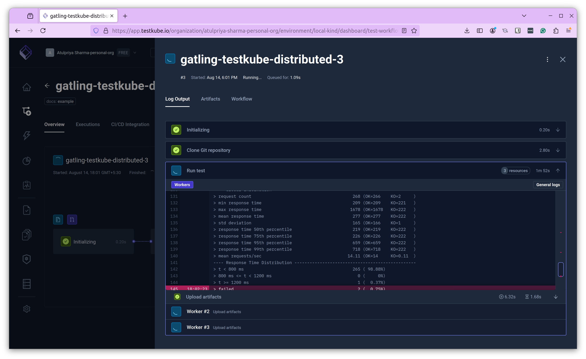
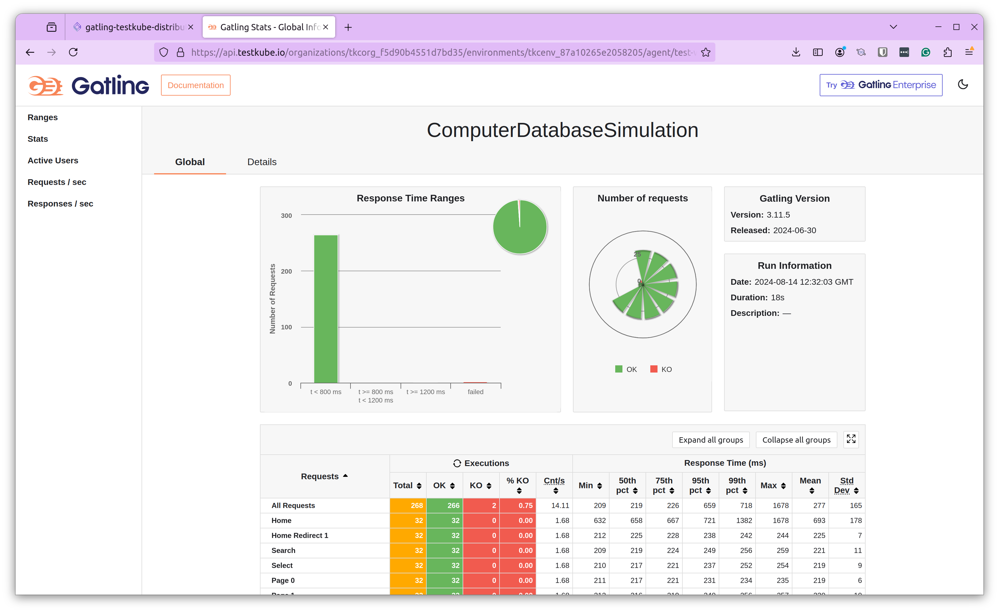

import Tabs from "@theme/Tabs";
import TabItem from "@theme/TabItem";
import DistributedGatling from "../../workflows/distributed-gatling-workflow.md"

# Distributed Gatling Example

import RequiresCommercialWorkflows from "../_commercial-workflows-note.mdx"

<RequiresCommercialWorkflows/>

Testkube has built-in support for parallelising any testing tool - check out the
[Parallelization](../test-workflows-parallel) documentation for details and examples. 

The below example shows how to distribute a Gatling test across a configurable
number of nodes:

* Takes optional run configuration parameters (`config`)
    * `vus` to declare Virtual Users to distribute
    * `duration` to declare Load Test time
    * `workers` to declare number of Gatling instances to create
* Load the Gatling script from Git repository (`content`)
    * Git URI: `https://github.com/kubeshop/testkube-examples`
    * Path: `Gradle/Gatling/Distributed`    
* Run distributed Gatling tests (`spec.steps[0].parallel`)
    * It uses the built-in `distribute/evenly` Test Workflow Template, which sets [`pod.topologySpreadConstraints`](https://kubernetes.io/docs/concepts/scheduling-eviction/topology-spread-constraints/) to distribute pods evenly across nodes (`spec.steps[0].parallel.use`)
    * It creates as many Gatling workers as declared in `workers` config (`spec.steps[0].parallel.count`)
    * It copies the test case from Git repository into workers (`spec.steps[0].parallel.transfer`)
    * It reserves 1/8 CPU and 128MB for each worker (`spec.steps[0].parallel.container.resources`)
    * It ensures that all workers will start the load tests simultaneously when all are ready (`spec.steps[0].parallel.paused`)
    * It runs the Gatling executable against that test case (`spec.steps[0].parallel.run.shell`)
      * It passes the number of Virtual Users and test duration via Gatling parameters
    * It retrives the generated HTML reports as artifacts from the directory ` /data/repo/Gradle/Gatling/Distributed/build/reports/`

<DistributedGatling/>

<Tabs>
<TabItem value="logs" label="Log Output" default>

The Gatling log output from one of the workers: 

</TabItem>
<TabItem value="html-report" label="HTML Report" default>

Clicking on Open Report in the artifacts or selecting index.html loads the complete report live in your browser:

</TabItem>

</Tabs>