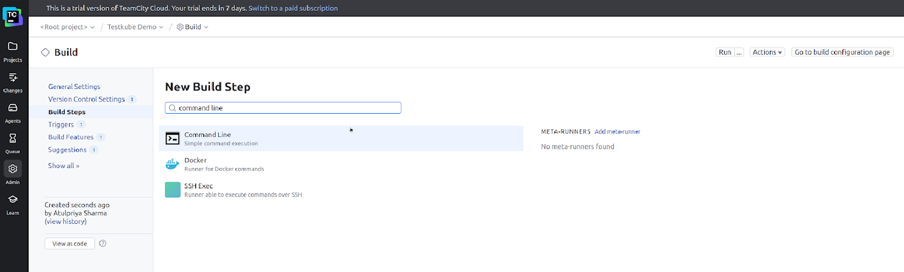
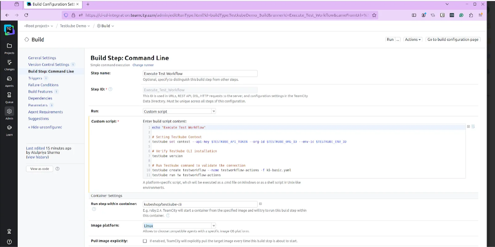
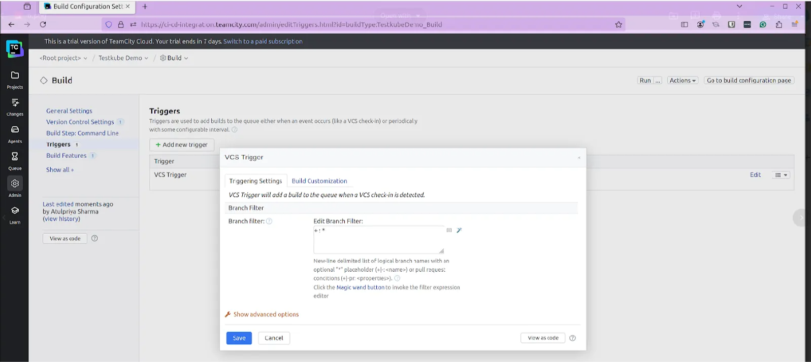
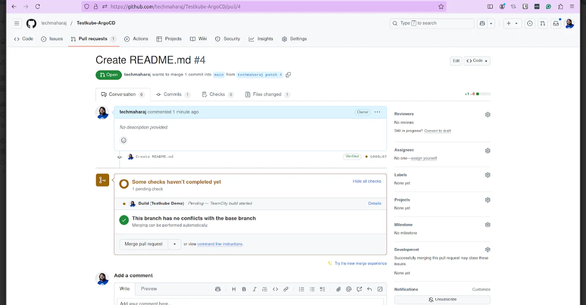
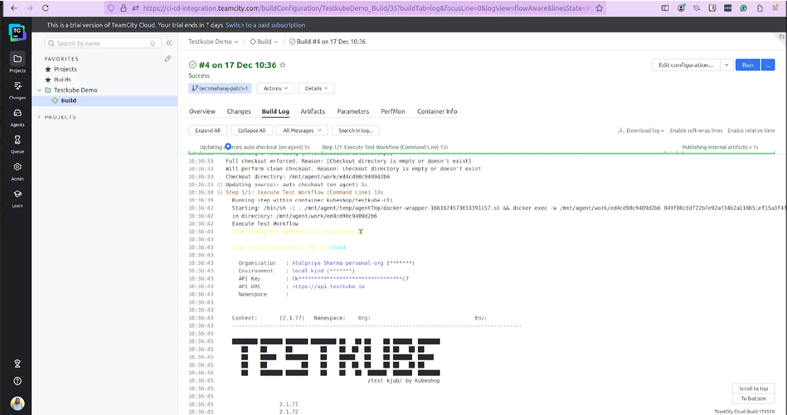

# Using Testkube with TeamCity

[TeamCity](https://www.jetbrains.com/teamcity/) is a powerful CI/CD server and build management tool developed by JetBrains. It is designed to automate tasks such as code creation, testing, and deployment, hence improving the software development process experience. It enables teams to provide feedback on all code-related changes, allowing them to rapidly identify and resolve issues beforehand, remove code integration challenges, and promote effective collaboration. 

## TeamCity Integration

Integrating Testkube and TeamCity improves the CI/CD pipeline by automatically deploying and running tests in a Kubernetes cluster. This configuration allows TeamCity to automatically initiate Testkube-managed test workflows in response to events such as new pull requests, enabling continuous testing throughout the development lifecycle. 

### Prerequisites

* A [TeamCity server account](https://www.jetbrains.com/teamcity/) is required to set up and manage the CI/CD pipelines
* A [Testkube account](https://testkube.io/get-started)
* Kubernetes cluster
* [Testkube Agent](https://docs.testkube.io/articles/install/multi-cluster) configured on the cluster
* A GitHub repo containing test workflows and files

To use TeamCity CI/CD for [Testkube](https://app.testkube.io/), you need to create an [API token](https://docs.testkube.io/testkube-pro/articles/organization-management/#api-tokens). Then, provide the **organization** and **environment** IDs, as well as the token and any additional information specific to your use case.


1. In your TeamCity project, define a new build configuration by selecting "Command Line" as the build runner type.

**Note:** TeamCity will attempt to automatically detect the build steps if a build file already exists in the VCS repo. If no build configuration file exists, you will have to manually configure the build steps.



2. On the Build Step page, enter the details needed to configure and execute the build step.



3. In this step, add a custom script with the following commands:

```sh
echo "Execute Test Workflow"

# Setting Testkube Context
testkube set context --api-key $TESTKUBE_API_TOKEN --org-id $TESTKUBE_ORG_ID --env-id $TESTKUBE_ENV_ID
     	 
# Verify Testkube CLI installation
testkube version
              	 
# Run Testkube command to validate the connection
testkube create testworkflow --name testworkflow-actions -f k6-basic.yaml
testkube run tw testworkflow-actions
```

4. Once the build steps have been configured, create a VCS trigger in the Triggers section to add a build automatically whenever changes are made to the repo.



5. After configuring the Triggers section, navigate to the "Build Features" section to add features that will extend the build process. In addition, you may set features like "Commit Status Publisher" to display build status in the repo. 

6. Once the pipeline has been configured, make a change to the repo and commit it by creating a pull request.
This action will trigger the TeamCity pipeline and run the Testkube CLI commands as part of the build process.



7. Navigate to the project in TeamCity to view the build status and logs. The interface will show whether the test workflow executed successfully or encountered issues.



8. When TeamCity triggers the pipeline, it executes the Testkube test by connecting to the target Kubernetes cluster, deploying the required test, and executing the defined workflow.


## Summary

Testkube's integration into TeamCity allows you to seamlessly automate test workflows within your CI/CD pipeline. Following the processes outlined above can improve the development process by incorporating continuous testing, ensuring timely feedback on code changes while maintaining high quality software delivery. 